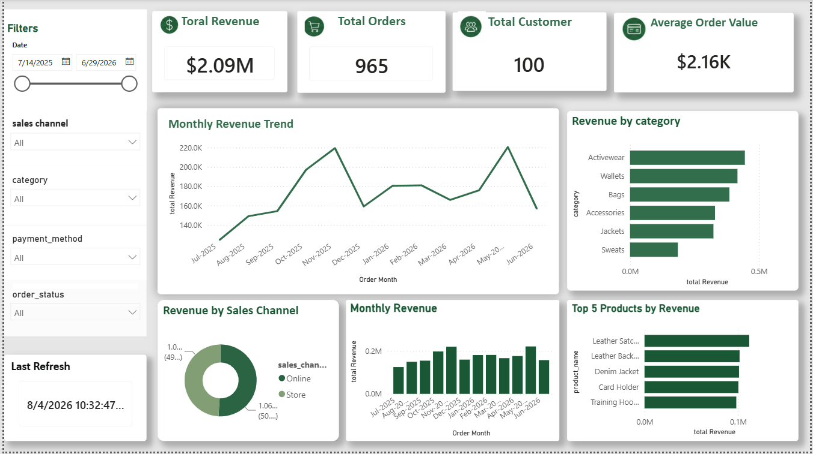

# Omnichannel Retail Analytics Data Platform

## Project Overview

This project simulates an **omnichannel retail analytics platform** designed to transform raw retail data into trusted analytics assets for business reporting and decision-making.

The goal is to build an end-to-end analytics workflow using data generation, transformation, SQL analysis, data modeling, and BI visualization.

## Business Scenario

The platform represents a retail company operating across multiple channels:

* E-commerce transactions
* Store sales
* Inventory systems
* Customer data
* Marketing campaigns

The objective is to provide insights into sales performance, customer behavior, product performance, and operational efficiency.

---

## Data Pipeline Architecture

```
Python Data Generation
          ↓
Raw Retail Data (CSV)
          ↓
Data Transformation & Validation
          ↓
SQL Analysis
          ↓
Power BI Dashboard
          ↓
Business Insights
```

---

## Technologies Used

* Python (Pandas)
* SQL
* Snowflake
* Power BI
* Git & GitHub
* Data Modeling
* Star Schema Design

---

## Data Model

The project follows a star schema approach:

### Fact Table

**Fact_Sales**

Contains transactional measures:

* Order ID
* Customer ID
* Product ID
* Quantity
* Revenue
* Order Date

### Dimension Tables

**Customers**

* Customer information
* Customer attributes

**Products**

* Product details
* Categories
* Pricing information

**Date Dimension**

* Time-based reporting attributes

---

# Power BI Dashboard

The dashboard provides insights into:

* Retail sales performance
* Customer behavior
* Product performance
* Category trends

## Dashboard Overview



## Key Features

* Revenue and order KPIs
* Monthly sales trend analysis
* Top-performing products
* Customer analysis
* Category performance

---

## Business Questions

This project answers questions such as:

* What are the overall sales and revenue trends?
* Which products generate the highest revenue?
* Which categories perform best?
* Who are the highest-value customers?
* How does sales performance change over time?

---

## Project Structure

```
omnichannel-retail-data-platform

├── data
│   ├── raw
│   └── processed
│
├── python
│   ├── data generation scripts
│   └── analysis scripts
│
├── sql
│   └── analytical queries
│
├── powerbi
│   ├── Retail_Analytics_Dashboard.pbix
│   └── screenshots
│
└── README.md
```

---

## Future Improvements

* Implement automated ETL pipelines
* Connect Snowflake as the analytics warehouse
* Add data quality checks
* Create scheduled dashboard refresh workflows
